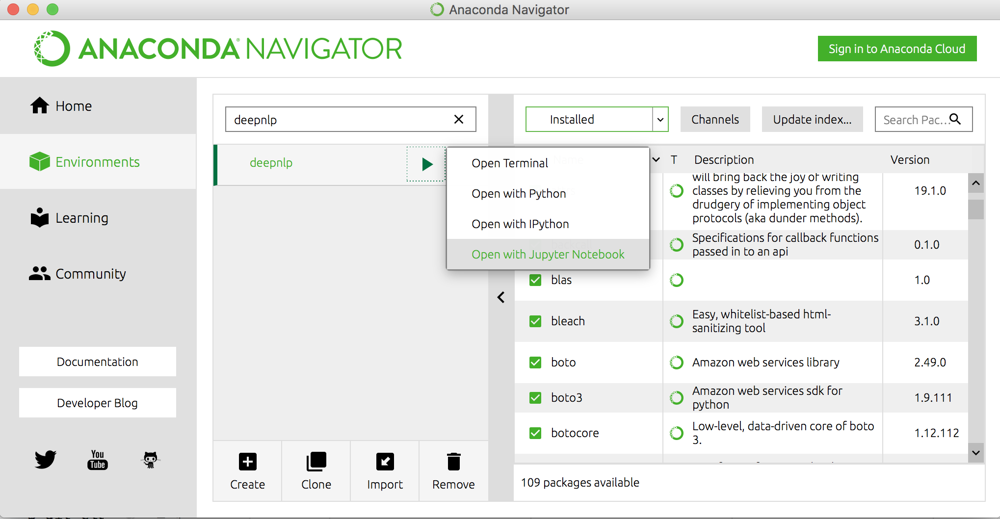
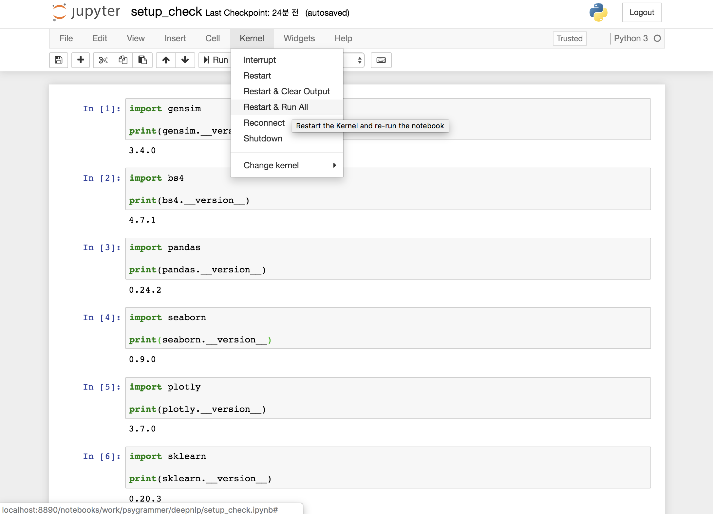

# deepnlp

1. 환경 셋팅

기본 전제> git과 anaconda가 설치되어 있어야 한다. 

```shell
(저장소 cloning)
$ git clone https://github.com/psygrammer/deepnlp.git

(소스 루트 디렉토리로 이동 후)
$ cd deepnlp

(실습용 아나콘다 환경셋팅을 위해 다음 명령 실행)
$ conda env create -f environment.yml
```

2. 실습환경

```shell
위의 환경셋팅이 끝나면 
anacoda navigator에서 deepnlp 가상환경을 찾아 jupyter notebook 실행
```


3. 설치 확인

```shell
실행된 jupyter notebook 웹 브라우저를 통해 
소스가 있는 디렉토리로 이동. 
그리고 setup_check.ipynb 노트북을 Restart & Run All

모든 패키지가 이상없이 버전 정보가 나오면 성공
```

